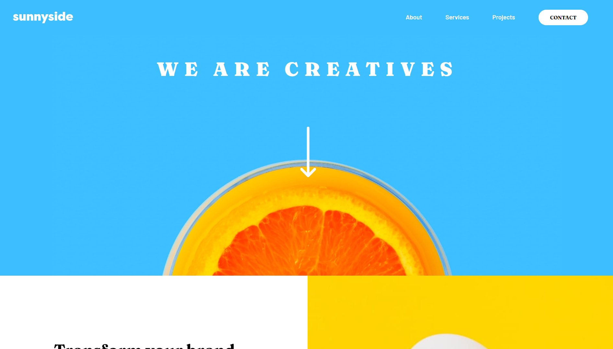

# Frontend Mentor - Sunnyside agency landing page solution

This is a solution to the [Sunnyside agency landing page challenge on Frontend Mentor](https://www.frontendmentor.io/challenges/sunnyside-agency-landing-page-7yVs3B6ef). Frontend Mentor challenges help you improve your coding skills by building realistic projects.

## Table of contents

- [Frontend Mentor - Sunnyside agency landing page solution](#frontend-mentor---sunnyside-agency-landing-page-solution)
  - [Table of contents](#table-of-contents)
  - [Overview](#overview)
    - [The challenge](#the-challenge)
    - [Screenshot](#screenshot)
    - [Links](#links)
  - [My process](#my-process)
    - [Built with](#built-with)
    - [What I learned](#what-i-learned)
    - [Continued development](#continued-development)
    - [Useful resources](#useful-resources)
  - [Author](#author)

**Note: Delete this note and update the table of contents based on what sections you keep.**

## Overview

### The challenge

Users should be able to:

- View the optimal layout for the site depending on their device's screen size
- See hover states for all interactive elements on the page

### Screenshot



### Links

- Solution URL: [GitHub](https://github.com/Bry-cmd/sunnyside-agency-landing-page-main)
- Live Site URL: [GitHub Pages](https://bry-cmd.github.io/sunnyside-agency-landing-page-main/)

## My process

### Built with

- Semantic HTML5 markup
- CSS custom properties
- CSS Grid
- SASS
- Vanilla JS

### What I learned

I was initially going to use this challenge as an exercise to get me started with Bootstrap. However, when I got started, I realized that I had to change the templates provided by Bootstrap so much that I found it simpler to just start from scratch. So, I decided to use this challenge to practice SASS and the BEM (Block Element Modifier) CSS naming convention. Essentially, in a nested layout, the parent (or block) would be given a simple descriptive name. The names of the children (or element) will be based off of the name of the block. An example of which is shown below.

```html
<div class="main-content">  <!-- BLOCK -->
  <div class="main-content__row"> <!-- ELEMENT [block__element] -->
    <div class="main-content__cell"> <!-- ELEMENT [block__element] -->
    </div>
  </div>
</div>
```

When you want to change the appearance of a block or element, you add a modifier class.

```html
<div class="main-content main-content--red">  <!-- MODIFIER [block--modifier] -->
  <div class="main-content__row main-content__row--black"> <!-- MODIFIER [element--modifier] -->
    <div class="main-content__cell">
    </div>
  </div>
</div>
```

I found the naming convention to be super useful, especially because it integrates extremely well with SASS, which allows nesting.

```css
// Regular CSS
.main-content {
  display: grid;
  grid-template-columns: repeat(3, 1fr);
}

.main-content--red {
  background-color: red;
}

.main-content__row {
  width: 80%;
  margin: auto;
}

.main-content__row--black {
  background-color: black;
}

// SASS

.main-content {
  display: grid;
  grid-template-columns: repeat(3, 1fr);

  &--red {
    background-color: red;
  }

  &__row {
    width: 80%;
    margin: auto;

    &--black {
      background-color: black;
    }
  }
}
```

I'm not entirely sure if this is the proper way to use SASS or BEM, but I will definitely be using them in future projects because they're really convenient, so I'll do my best to get better. I also learned 

Lastly, I learned that about the justify-self property in CSS, which helps align an object along its container's axis. This was super useful in helping my layout, especially with the navbar and popup menu since, before, I'd just use margins to try to get the element as close to the end as possible without it overflowing.

```css
.triangle {
  justify-self: end; //Aligns element with class "triangle" to the end of its container's axis
}
```

### Continued development

I definitely want to get better using BEM and SASS since I find them super useful in organizing my code. I'm not entirely sure how to utilize BEM yet because I don't know how to use modifier classes since some of my CSS declarations for the block or element are so short that I find it unnecessary to create a separate class just for them. I definitely want to improve my JS next, since that will help make my websites more dynamic and interactive (and currently, among HTML, CSS, and JS, I know JS the least). I want to get better on how to code with JS and also in organizing my JS code, since my JS scripts are usually so short that they don't really need organization as of the moment.

### Useful resources

- [CSS Tricks](https://css-tricks.com/) - This site is really good for picking up on useful CSS techniques I use in my challenges.
- [BEM Naming Convention](http://getbem.com/naming/) - This article is a really good read since it does a really good job in explaining what the BEM Naming Convention is. It's also a short read.
- [w3schools](https://www.w3schools.com/) - A really good website for searching up HTML tags or CSS operators which I forgot how to use or want to pick up quickly.

## Author

- Website - [My GitHub](https://github.com/Bry-cmd)
- Frontend Mentor - [@Bry-cmd](https://www.frontendmentor.io/profile/Bry-cmd)
- LinkedIn - [Bryan Sanchez](https://www.linkedin.com/in/bryan-sanchez-b316b7203/)